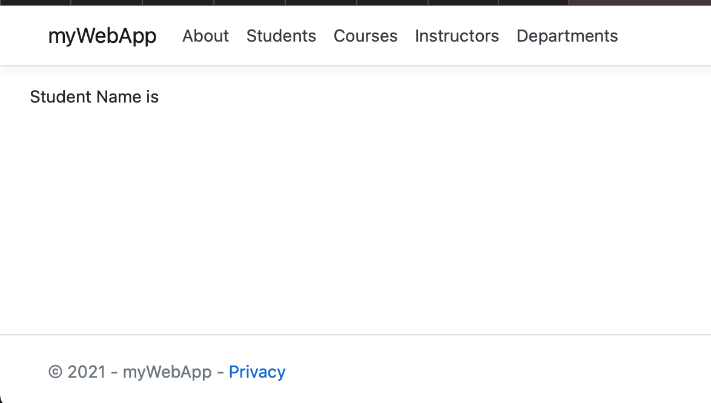
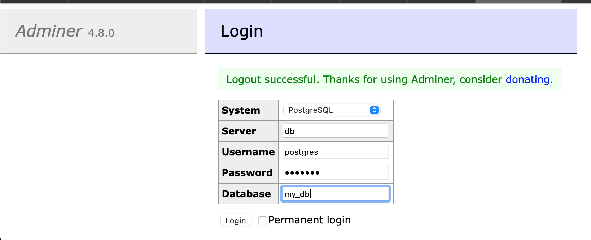
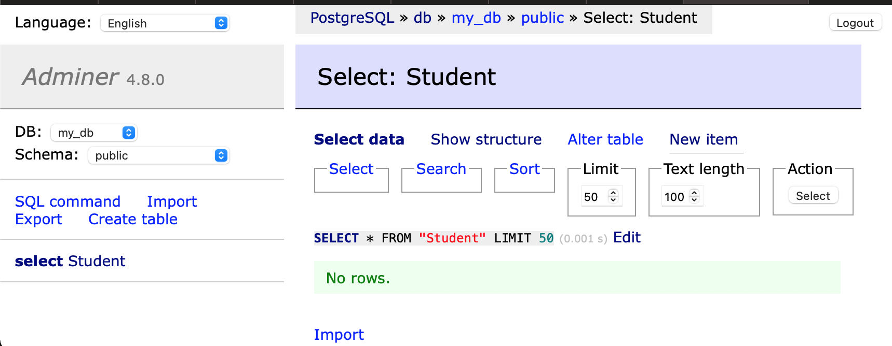
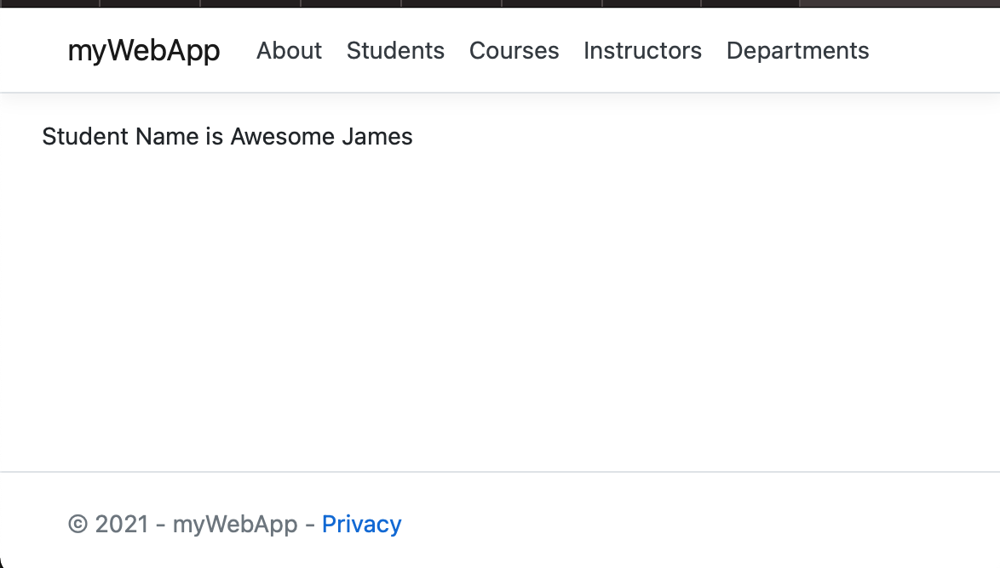

- [What is Docker Compose](#what-is-docker-compose)
- [Update the myWebapp ](#update-the-mywebapp)
- [Configuration file](#configuration-file)
- [Start application](#start-application)
- [Verify application](#verify-application)
- [Shutdown application](#shutdown-application)

## What is Docker Compose


Docker Compose is a tool for defining and running complex applications with Docker. With Compose, you define a multi-container application in a single file, then spin your application up in a single command which does everything that needs to be done to get it running.

An application using Docker containers will typically consist of multiple containers. With Docker Compose, there is no need to write shell scripts to start your containers. All the containers are defined in a configuration file using _services_, and then `docker-compose` script is used to start, stop, and restart the application and all the services in that application, and all the containers within that service. The complete list of commands is:

| Command | Purpose |
:------------ | :-------------| 
| `build` | Build or rebuild services |
| `help` | Get help on a command |
| `kill` | Kill containers|
| `logs` | View output from containers|
| `port` | Print the public port for a port binding|
| `ps` | List containers|
| `pull` | Pulls service images|
| `restart` | Restart services|
| `rm` | Remove stopped containers|
| `run` | Run a one-off command|
| `scale` | Set number of containers for a service|
| `start` | Start services|
| `stop` | Stop services|
| `up` | Create and start containers|

The application used in this section is built based on myWebapp communicating with a Postgresql database. When the page is loaded, it will query the Student table for the record with ID and display the name of student on the page.

The myWebApp and Postgresql will be running in two separate containers, and thus making this a multi-container application.

## Update the myWebapp 

1. adding package to allow app taking to database

```
cd myWebapp
dotnet add package Npgsql.EntityFrameworkCore.PostgreSQL
```

2. create student model

- Create a Models folder in the project folder

- Create Models/Student.cs with the following code:

```
using System;
using System.Collections.Generic;

namespace myWebApp.Models
{
    public class Student
    {
        public int ID { get; set; }
        public string LastName { get; set; }
        public string FirstMidName { get; set; }
        public DateTime EnrollmentDate { get; set; }

    }
}
```
3. Create the SchoolContext with the following code

```
using Microsoft.EntityFrameworkCore;

namespace myWebApp.Data
{
    public class SchoolContext : DbContext
    {
        public SchoolContext (DbContextOptions<SchoolContext> options)
            : base(options)
        {
        }

        public DbSet<Models.Student> Students { get; set; }


        protected override void OnModelCreating(ModelBuilder modelBuilder)
        {

            modelBuilder.Entity<Models.Student>().ToTable("Student");
        }
    }
}
```


4. Adding database connectionstring to appsettings.json

```
{
  "Logging": {
    "LogLevel": {
      "Default": "Information",
      "Microsoft": "Warning",
      "Microsoft.Hosting.Lifetime": "Information"
    }
  },
  "AllowedHosts": "*",
  "ConnectionStrings": {
    "SchoolContext": "Host=db;Database=my_db;Username=postgres;Password=example"
  }
}
```
5. Boostrap the table if it does not exist in Program.cs

```
 using Microsoft.EntityFrameworkCore;
var builder = WebApplication.CreateBuilder(args);

// Add services to the container.

builder.Services.AddRazorPages();
builder.Services.AddDbContext<myWebApp.Data.SchoolContext>(options =>
  options.UseNpgsql(builder.Configuration.GetConnectionString("SchoolContext")));
var app = builder.Build();
using (var scope = app.Services.CreateScope())
{
    var services = scope.ServiceProvider;

    var context = services.GetRequiredService<myWebApp.Data.SchoolContext>();
    context.Database.EnsureCreated();
    // DbInitializer.Initialize(context);
}
// Configure the HTTP request pipeline.
if (!app.Environment.IsDevelopment())
{
    app.UseExceptionHandler("/Error");
}else{
    //  app.UseDeveloperExceptionPage();
}
app.UseStaticFiles();

app.UseRouting();

app.UseAuthorization();

app.MapRazorPages();

app.Run();
```
let update the UI

Index.cshtml

```
<div class="row mb-auto">
    <p>Student Name is @Model.StudentName</p>
</div>
```

and Index.cshtml.cs

```
    public class IndexModel : PageModel
    {
        public string StudentName { get; private set; } = "PageModel in C#";
         private readonly ILogger<IndexModel> _logger;
        private readonly myWebApp.Data.SchoolContext _context;

        public IndexModel(ILogger<IndexModel> logger, myWebApp.Data.SchoolContext context)
        {
            _logger = logger;
            _context= context;
        }

        public void OnGet()
        {
            var s =_context.Students.Where(d=>d.ID==1).FirstOrDefault();
            this.StudentName = $"{s?.FirstMidName} {s?.LastName}";
           
        }
    }
```

## Configuration file

The entry point to Docker Compose is a Compose file, usually called `docker-compose.yml`. In project directory, create a new file `docker-compose.yml` in it. Use the following contents:

```
services:

  db:
    image: postgres
    restart: always
    environment:
      POSTGRES_PASSWORD: example
    volumes:
      - postgres-data:/var/lib/postgresql/data
  adminer:
    image: adminer
    restart: always
    ports:
      - 8080:8080
  app:
    build:
      context: .
      dockerfile: ./Dockerfile
    ports:
      - 5000:80
      
    depends_on:
    - db
volumes:
  postgres-data:
    
```

In this Compose file:

- Two services in this Compose are defined by the name `db` and `web` attributes; the adminer service is a helper for us to access db 
- Image name for each service defined using `image` attribute
- The `postgres` image starts the Postgres server.
- `environment` attribute defines environment variables to initialize postgres server.
  -   `POSTGRES_PASSWORD` are used set that default user,**postgres** password. This user will be granted superuser permissions for the database **my_db** in the connectionstring.
- app application uses the `db` service as specified in the connection string
- The app image is built using the Dockerfile in the project directory
- Port forwarding is achieved using `ports` attribute.
- `depends_on` attribute allows to express dependency between services. In this case, Postgres will be started before app. Application-level health check are still user's responsibility.

## Start application

All services in the application can be started, in detached mode, by giving the command:

```
docker-compose up -d
```

An alternate Compose file name can be specified using `-f` option.

An alternate directory where the compose file exists can be specified using `-p` option.

This shows the output as:

```
docker-compose up -d
Starting mywebapp_adminer_1 ... done
Starting mywebapp_db_1      ... done
Starting mywebapp_app_1     ... done
```

The output may differ slightly if the images are downloaded as well.

Started services can be verified using the command `docker-compose ps`:

```
docker-compose ps
       Name                     Command               State           Ports
------------------------------------------------------------------------------------
mywebapp_adminer_1   entrypoint.sh docker-php-e ...   Up      0.0.0.0:8080->8080/tcp
mywebapp_app_1       ./myWebApp                       Up      0.0.0.0:5000->80/tcp
mywebapp_db_1        docker-entrypoint.sh postgres    Up      5432/tcp
```

This provides a consolidated view of all the services, and containers within each of them.

Alternatively, the containers in this application, and any additional containers running on this Docker host can be verified by using the usual `docker container ls` command:

```
docker container ls
CONTAINER ID   IMAGE          COMMAND                  CREATED          STATUS              PORTS                    NAMES
ee35a9399b80   mywebapp_app   "./myWebApp"             29 minutes ago   Up About a minute   0.0.0.0:5000->80/tcp     mywebapp_app_1
0fc85278791c   postgres       "docker-entrypoint.s…"   30 minutes ago   Up About a minute   5432/tcp                 mywebapp_db_1
a9c725d0e684   adminer        "entrypoint.sh docke…"   30 minutes ago   Up About a minute   0.0.0.0:8080->8080/tcp   mywebapp_adminer_1

```

Service logs can be seen using `docker-compose logs` command, and looks like:

```
docker container logs mywebapp_db_1

PostgreSQL Database directory appears to contain a database; Skipping initialization

2021-03-16 04:19:51.862 UTC [1] LOG:  starting PostgreSQL 13.2 (Debian 13.2-1.pgdg100+1) on x86_64-pc-linux-gnu, compiled by gcc (Debian 8.3.0-6) 8.3.0, 64-bit
2021-03-16 04:19:51.863 UTC [1] LOG:  listening on IPv4 address "0.0.0.0", port 5432
2021-03-16 04:19:51.863 UTC [1] LOG:  listening on IPv6 address "::", port 5432
2021-03-16 04:19:51.868 UTC [1] LOG:  listening on Unix socket "/var/run/postgresql/.s.PGSQL.5432"
2021-03-16 04:19:51.875 UTC [29] LOG:  database system was shut down at 2021-03-16 04:19:04 UTC
2021-03-16 04:19:51.884 UTC [1] LOG:  database system is ready to accept connections
2021-03-16 04:20:03.442 UTC [1] LOG:  received fast shutdown request
2021-03-16 04:20:03.444 UTC [1] LOG:  aborting any active transactions
2021-03-16 04:20:03.446 UTC [1] LOG:  background worker "logical replication launcher" (PID 35) exited with exit code 1
2021-03-16 04:20:03.447 UTC [30] LOG:  shutting down
2021-03-16 04:20:03.473 UTC [1] LOG:  database system is shut down

PostgreSQL Database directory appears to contain a database; Skipping initialization

2021-03-16 04:20:53.597 UTC [1] LOG:  starting PostgreSQL 13.2 (Debian 13.2-1.pgdg100+1) on x86_64-pc-linux-gnu, compiled by gcc (Debian 8.3.0-6) 8.3.0, 64-bit
2021-03-16 04:20:53.597 UTC [1] LOG:  listening on IPv4 address "0.0.0.0", port 5432
2021-03-16 04:20:53.597 UTC [1] LOG:  listening on IPv6 address "::", port 5432
2021-03-16 04:20:53.601 UTC [1] LOG:  listening on Unix socket "/var/run/postgresql/.s.PGSQL.5432"
2021-03-16 04:20:53.606 UTC [26] LOG:  database system was shut down at 2021-03-16 04:20:03 UTC
2021-03-16 04:20:53.618 UTC [1] LOG:  database system is ready to accept connections
2021-03-16 04:21:31.054 UTC [38] ERROR:  invalid input syntax for type timestamp: "" at character 91
2021-03-16 04:21:31.054 UTC [38] STATEMENT:  INSERT INTO "Student" ("LastName", "FirstMidName", "EnrollmentDate")
	VALUES ('YHH', 'HH', '')
2021-03-16 04:33:09.323 UTC [1] LOG:  received fast shutdown request
2021-03-16 04:33:09.325 UTC [1] LOG:  aborting any active transactions
2021-03-16 04:33:09.327 UTC [1] LOG:  background worker "logical replication launcher" (PID 32) exited with exit code 1
2021-03-16 04:33:09.329 UTC [27] LOG:  shutting down
2021-03-16 04:33:09.342 UTC [1] LOG:  database system is shut down

PostgreSQL Database directory appears to contain a database; Skipping initialization

2021-03-16 04:49:23.844 UTC [1] LOG:  starting PostgreSQL 13.2 (Debian 13.2-1.pgdg100+1) on x86_64-pc-linux-gnu, compiled by gcc (Debian 8.3.0-6) 8.3.0, 64-bit
2021-03-16 04:49:23.844 UTC [1] LOG:  listening on IPv4 address "0.0.0.0", port 5432
2021-03-16 04:49:23.844 UTC [1] LOG:  listening on IPv6 address "::", port 5432
2021-03-16 04:49:23.849 UTC [1] LOG:  listening on Unix socket "/var/run/postgresql/.s.PGSQL.5432"
2021-03-16 04:49:23.855 UTC [26] LOG:  database system was shut down at 2021-03-16 04:33:09 UTC
2021-03-16 04:49:23.862 UTC [1] LOG:  database system is ready to accept connections
```

## Verify application

Let's access the application. In your browser address bar type http://localhost:5000

you will see the page show no student name since the database is empty.



now open another tab with address http://localhost:8080 and you will be asked to login 



use **postgres** and **example** as username/passowrd to login my_db.

once you are logged in, you can create a new student record



Now, refresh the app page at http://localhost:5000, the new added student name will be there,


## Shutdown application

Shutdown the application using `docker-compose down`:

```
docker-compose down
Stopping mywebapp_app_1     ... done
Stopping mywebapp_db_1      ... done
Stopping mywebapp_adminer_1 ... done
Removing mywebapp_app_1     ... done
Removing mywebapp_db_1      ... done
Removing mywebapp_adminer_1 ... done
Removing network mywebapp_default
```

This stops the container in each service and removes all the services. It also deletes any networks that were created as part of this application.
