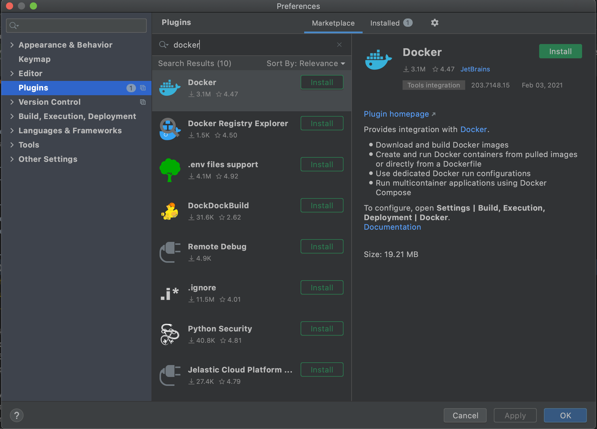
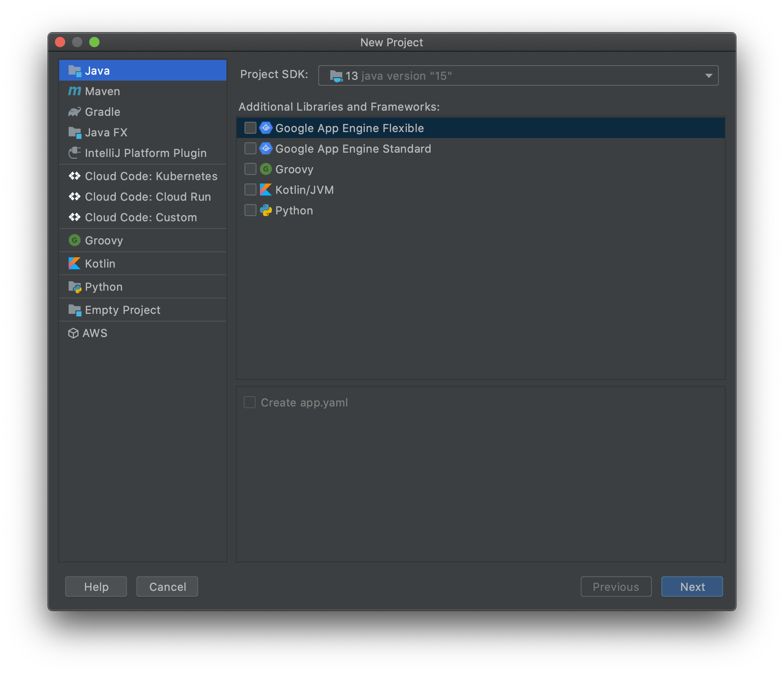
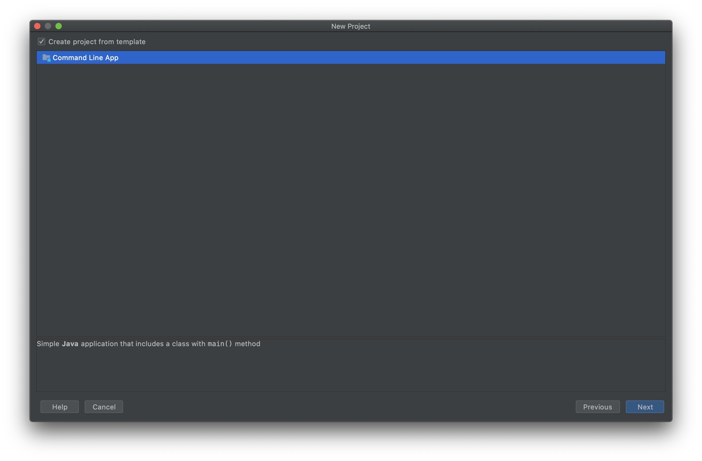
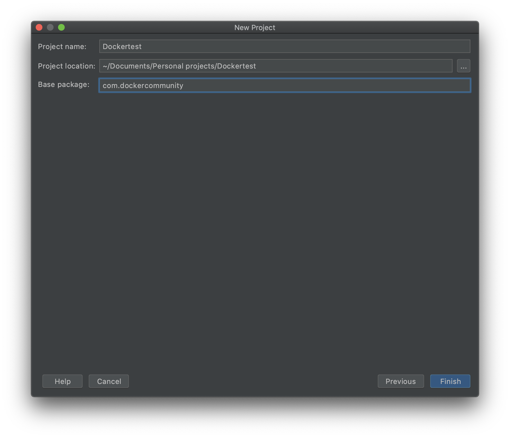
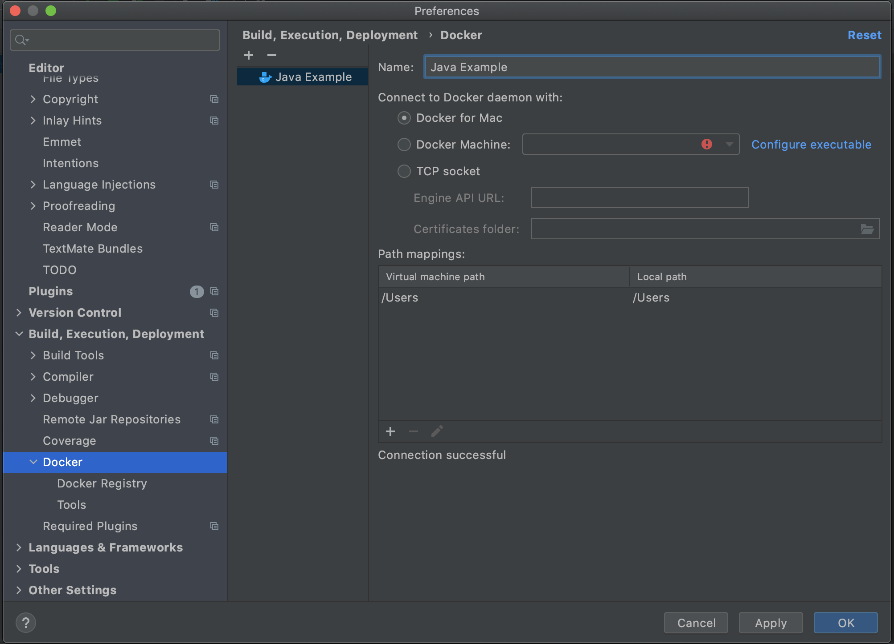
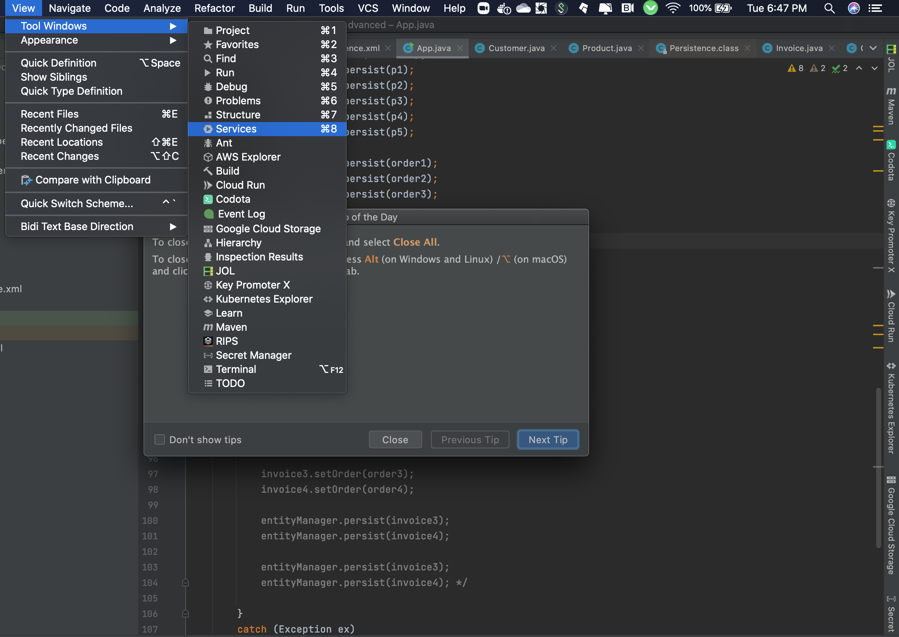
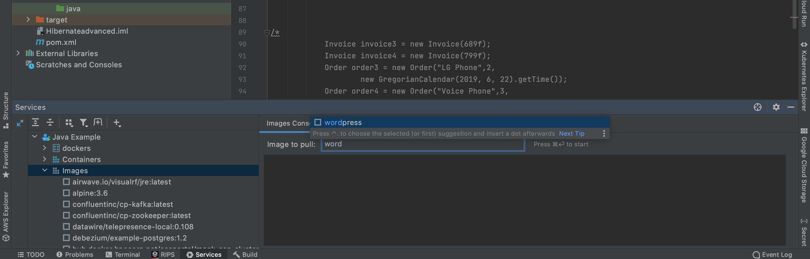
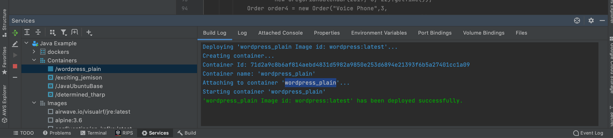

- [Install Docker Plugin in IDEA](#install-docker-plugin-in-idea)
- [Pull an Image](#pull-an-image)
- [Run a Container](#run-a-container)
- [Build an Image](#build-an-image)

## Docker and IntelliJ IDEA

This chapter will show you basic Docker tooling with IntelliJ IDEA:

- Pull Docker images
- Run, stop, delete a Container
- Build an Image

## Install Docker Plugin in IDEA

Go to "`Preferences`", "`Plugins`",  search on "`docker`" and click on "`Install`"



Restart IntelliJ IDEA to active plugin.

Click on "`Create New Project`", select "`Java`"



Click on "`Next`",and select  "`Command Line App`"


give the project a name "`Dockertest`", click on "`Finish`". This will open up the project in IntelliJ window.



Go to "`Preferences`", "`Docker`", add a new deployment by clicking on "`+`". 

If you want to use remote docker machine Click on "`Import credentials from Docker Machine`", "`Detect`", and see a successful connection. You may have to check the IP address of your Docker Machine. Find the IP address of your Docker Machine as `docker-machine ip <machine-name>` and specify the correct IP address here.


If you have installed docker in your Mac .Please use "`Docker for Mac`"


Go to "`View`", "`Tool Windows`", "`Services`". Click on "`Connect`" to connect with Docker. Make sure Docker is running




## Pull an Image

Select top-level node with the name "`Java Example`", click on "`Pull image`"



Type an image name, such as `wordpress`, and "`OK`"



Expand "`Containers`" and "`Images`" to see existing running containers and images.

The specified image is now downloaded and shown as well.

## Run a Container

Select the downloaded image, click on "`Create container`"

Select "`After launch`" and enter the URL as `http://192.168.99.100:8091`. Make sure to match the IP address of your Docker Machine.


In "`Container`" tab, add "`Port bindings`" for `8091:8091`


Click on "`Run`" to run the container.

This will bring up the browser window and display the page http://192.168.99.100:8091 and looks like:


This image uses http://developer.couchbase.com/documentation/server/current/rest-api/rest-endpoints-all.html[Couchbase REST API] to configure the Couchbase server. 

Right-click on the running container, select "`Inspect`" to see more details about the container.


Click on "`Stop container`" to stop the container and "`Delete container`" to delete the container.

## Build an Image

- Refer to the instructions https://www.jetbrains.com/help/idea/2016.1/docker.html

- Right-click on the project, create a new directory `docker-dir`
- Artifact
  - Click on top-right for "`Project Structure`"
  -  select "`Artifacts`"
  - change "`Type:`" to "`Web Application: Archive`"
  - change the name to `dockercon`
  - change `Output directory` to `docker-dir`
- Create "`Dockerfile`" in this directory. Use the contents


```
FROM jboss/wildfly

ADD dockercon.war /opt/jboss/wildfly/standalone/deployments/
```


- "`Run`", "`Edit Configurations`", add new "`Docker Deployment`"
  -  "`Deployment`" tab
     - Change the name to `dockercon`
     - Select "`After launch`", change the URL to "`http://192.168.99.100:18080/dockercon/index.jsp`"
     - In "`Before launch`", add "`Build Artifacts`" and select the artifact
   -  "`Container`" tab
     -  Add "`Port bindings`" for "`8080:18080`"
- View, Tool Windows, Docker, connect to it
- Run the project
