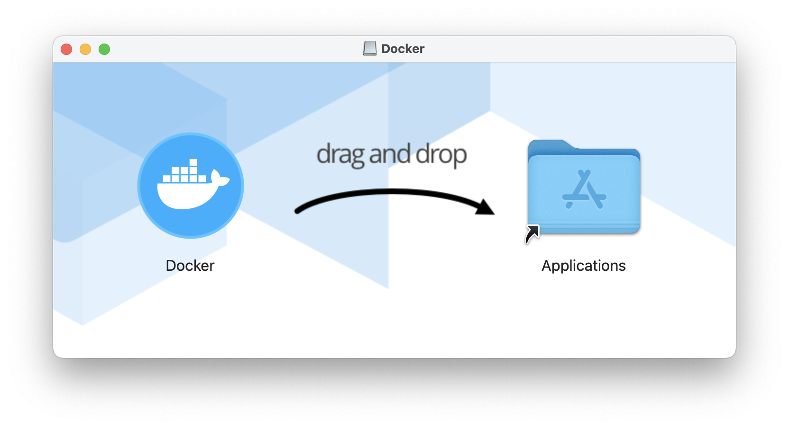
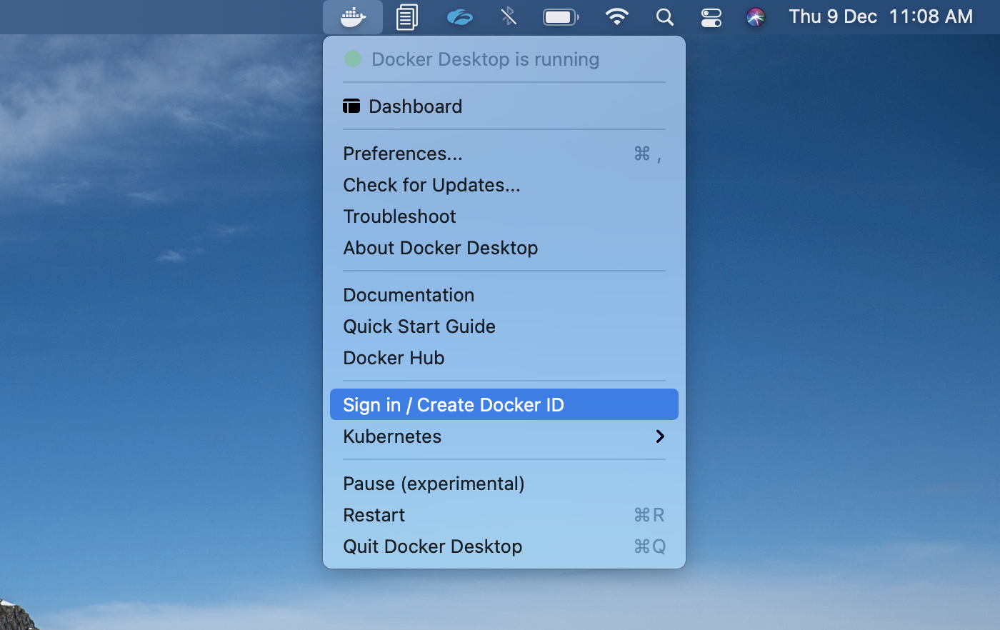
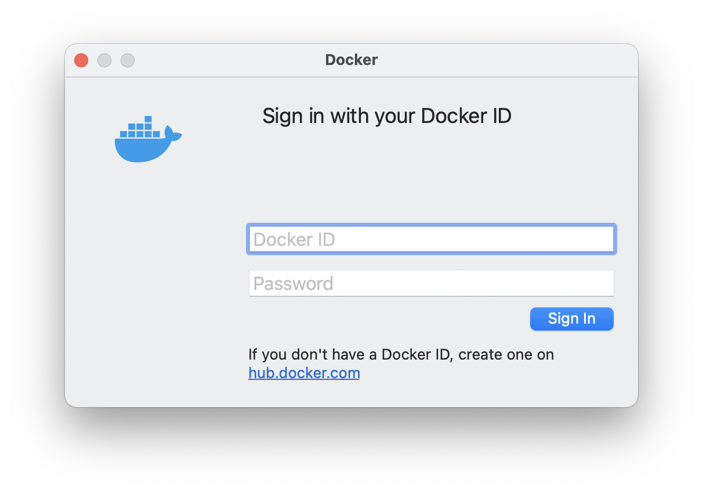
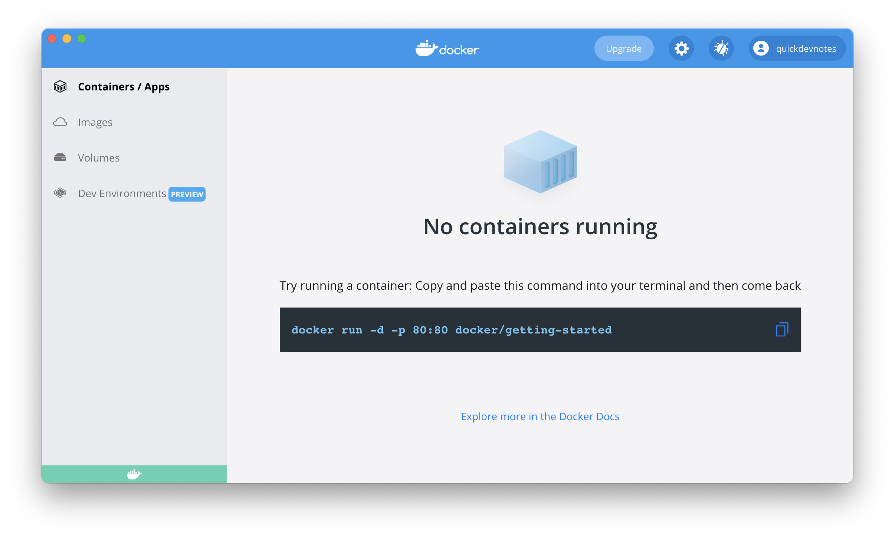
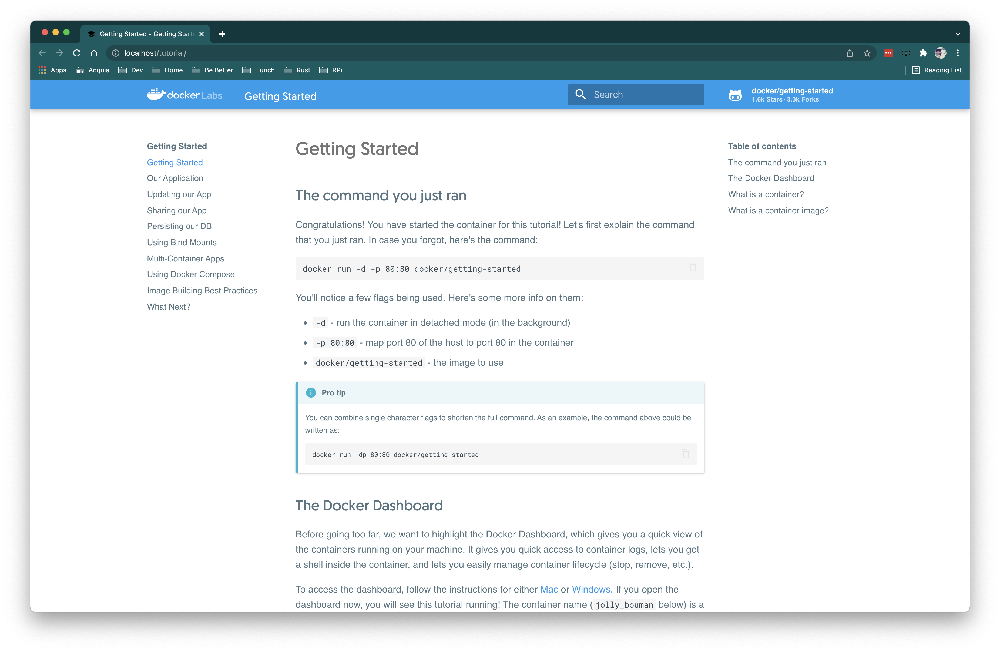

Before you get started, you should know that Docker Desktop is free for small businesses (fewer than 250 employees AND less than $10 million in annual revenue), personal use, education, and non-commercial open source projects.
You can read more about the subscription service agreement [here][1].

Now, let's get you onboard with Docker Desktop. :)

Visit the Docker Desktop [product page][2] and download the installer based on your system requirements. Launch the installer and follow the instructions. The example below shows the installation on Mac.

Once the installation completes, launch Docker Desktop from the applications.
You should then see Docker icon in the tray.
As you click on the icon, you will be able to login into or create a Dockerhub account using the Docker ID and password.

Once you login, you should be able to see your user account as you click the whale icon in the tray.
Now, from the options select Dashboard and you should see the following screen:

Copy the docker run command you see on the dashboard and run it on a terminal.

You should now be able to see a running container listed on the dashboard.
From the options on the right, select the first one to access the application in browser.

Congratulations!! You have successfully run your first container application with Docker Desktop.

[1]: https://www.docker.com/legal/docker-subscription-service-agreement
[2]: https://www.docker.com/products/docker-desktop

