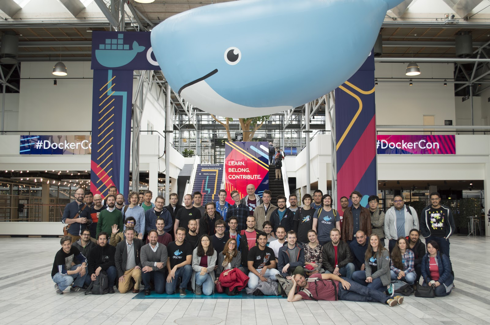

The Community Leaders program is designed to empower and support Community Leaders with the needed resources and event platform to plan, organise and host Docker events successfully. In the post-COVID world, we have specifically designed additional tools and resources to make it as simple and straightforward as possible to organise an IRL meetup or a virtual one.

## Docker User Groups
Docker User Groups  (also known as "Chapters") are groups that bring together Docker users and enthusiasts around the world. Each group has at least one Community Leader to drive activities (eg. virtual events, in-person meetups etc...). The Docker community is founded on principles of respect, inclusion, collaboration and opportunity. Our events are:

* Free to attend and open to the public
* Inclusive and encouraging of diversity
* A forum for educational and inspirational content and discussions (not for sales or recruitment pitches)
* Focused on Docker technology and the container ecosystem
* A place to connect and meet with other members of the Docker community
* In accordance with the Docker Community Code of Conduct

Discover Docker's User Groups [here](https://www.meetup.com/pro/docker)

## Benefits of joining the program

Joining the Community Leader program offers the following benefits:

* Identification as a Docker Community Leader
* Add your Community Leader status to your LinkedIn, Twitter, GitHub and let everyone know your role in the Docker community.
* Docker-funded Chapter pages on meetup.com
* Promotion of events on Docker social channels
* Logo files + marketing materials
* Guidance on running successful user group events
* Amazing network of inspiring community leaders
* Access to the Docker Community Team
* Swag for you and your community

## Requirements

* Be enthusiastic about Docker technology and committed to creating learning opportunities and building connections within your local community
* Organize and execute a minimum of four events per year. Manage your events using your city’s user group page on meetup.com/pro/docker
* Note: Docker could provide content for four events but you are responsible for all event logistics and sponsorship. For events where you prepare content, prioritize education and accuracy.
* Be a positive force in the Community. Set a good example and positively represent this group of amazing individuals.
* Abide by the Docker Community Code of Conduct
* Participate in the Community Leader program. Stay up to date, join the conversation, and make yourself available to communicate with the Docker team or other Community Leaders in a timely fashion.
* Be considerate of your responsibilities. We understand this is a volunteer position and life sometimes leads us in a different direction. If you can’t fulfill the responsibilities, please notify us so we can help with a transition.

Note that the Docker Community Leader Program thrives when leaders are active and committed to the goal of bringing Docker knowledge, skills and connections to their cities.

Program benefits will be tied to the status of the group as well as the contribution of individual Community Leaders. Users groups that have not had an event in 6 months will be considered inactive. If a year goes by without an event, the user group may be deactivated. Benefits like swag and recognition as a Community Leader will be reserved for active Community Leaders in good standing. Violation of the Community Leader Requirements or Docker Code of Conduct may result in being removed from the program.

<a href="https://forms.gle/MMzvAK9oMQViJsji6" class="btn btn-primary btn-success">Become a Docker Community Leader today</a>

## Questions?

Don't hesitate to reach out to us on the [Docker Community Slack](dockr.ly/slack) if you have any questions or feedback you want to share. Feel free to reach out to Alba Roza there.
